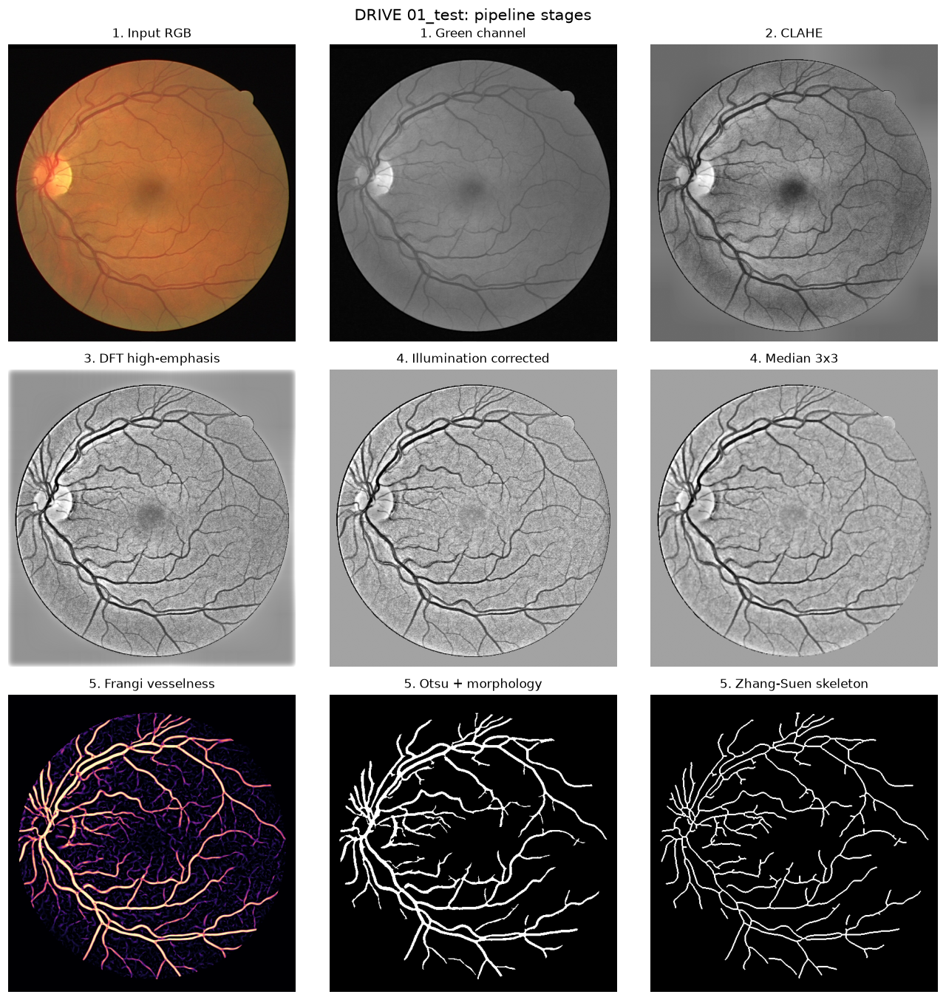
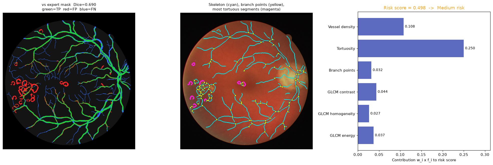
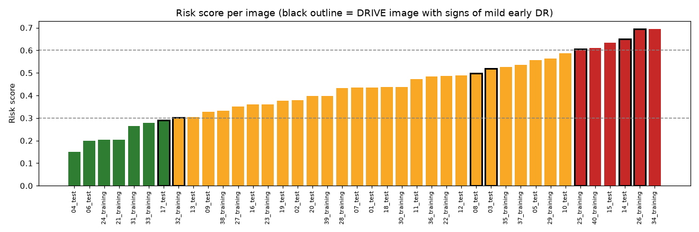

# Multi-Scale Frangi Retinal Vessel Segmentation with Rule-Based Structural–Texture Fusion for Explainable DR Risk

DIP course project (BCSE403L, Fall 2026-27).

The pipeline is training-free and runs on a CPU (~0.5 s per image). It takes a colour fundus photograph and produces:

- a segmented retinal vessel tree;
- six measurable features of that tree and the surrounding tissue;
- a single **Low / Medium / High** diabetic-retinopathy risk score, where every term in the score can be traced back to a feature you can check by hand.

```
RGB ─► M1 green channel + FOV mask ─► M2 CLAHE ─► M3 DFT high-emphasis ─► M4 illumination division + median
    ─► M5 multi-scale Frangi ─► Otsu ─► morphology ─► Zhang–Suen skeleton
    ─► M6 density · tortuosity · branch points · GLCM contrast/homogeneity/energy
    ─► M7 normalise ─► Σ wᵢ·fᵢ ─► Low / Medium / High
```



## Quick start

```bash
pip install -r requirements.txt
python scripts/download_drive.py      # DRIVE → data/DRIVE (or unzip DRIVE there yourself)
python scripts/run_all.py             # every number + figure below (~1 min on 4 cores)
streamlit run app/streamlit_app.py    # interactive demo
pytest -q tests                       # unit tests
python scripts/tune_params.py         # optional: re-run the parameter search (training split only)
```

## Repository layout

| Path | Contents |
|---|---|
| `drvessel/config.py` | All parameters (Table 1 of the report) |
| `drvessel/preprocess.py` | M1 green channel + FOV, M2 CLAHE, M3 DFT high-emphasis, M4 illumination correction + median |
| `drvessel/vessels.py` | M5 Hessian eigenvalues, Frangi vesselness (hand-written), Otsu, morphology, thinning |
| `drvessel/features.py` | M6 vessel density, tortuosity (arc/chord), branch points, masked GLCM |
| `drvessel/fusion.py` | M7 normalisation, weights, risk score, bands |
| `drvessel/metrics.py` | Se, Sp, Acc, Dice, Jaccard (inside FOV) |
| `drvessel/pipeline.py` | End-to-end runner + Otsu baseline |
| `drvessel/viz.py` | Stage montage, error overlay, skeleton overlay, contribution chart |
| `scripts/run_all.py` | Full evaluation → `results/` and `figures/` |
| `app/streamlit_app.py` | Demo: pick a DRIVE image or upload one, tune parameters live |

## Results on DRIVE

All metrics are computed inside the official DRIVE field-of-view masks against the 1st manual annotation. Full tables are in [`results/summary.md`](results/summary.md) and per-image values in [`results/per_image_results.csv`](results/per_image_results.csv).

### Segmentation

| Method | Split | Sensitivity | Specificity | Accuracy | Dice | Jaccard |
|---|---|---|---|---|---|---|
| **Proposed** | test (20) | 0.7300 | 0.9690 | 0.9381 | **0.7492** | 0.6002 |
| Otsu on green (baseline) | test (20) | 0.6354 | 0.4684 | 0.4924 | 0.1994 | 0.1155 |
| **Proposed** | all (40) | 0.7314 | 0.9637 | 0.9339 | **0.7386** | 0.5882 |
| Otsu on green (baseline) | all (40) | 0.6987 | 0.4196 | 0.4540 | 0.2144 | 0.1238 |

**How the parameters were set.** A handful of filter constants (CLAHE clip, high-pass cutoff, Frangi β and c, γ, morphology sizes) were fixed by grid search on the **20 training images only** (`scripts/tune_params.py`). The test split was never used for tuning. β = 0.5 and c = 15 from the original proposal came out best.

**Comparison with published unsupervised methods on DRIVE**, as reported in the original papers and the Fraz et al. (2012) survey (verify against the papers before citing):

| Method | Se | Sp | Acc |
|---|---|---|---|
| Chaudhuri et al. 1989 (matched filter) | – | – | 0.8773 |
| Zana & Klein 2001 | 0.6971 | – | 0.9377 |
| Mendonça & Campilho 2006 | 0.7344 | 0.9764 | 0.9452 |
| Nguyen et al. 2013 (multi-scale line) | – | – | 0.9407 |
| Azzopardi et al. 2015 (B-COSFIRE) | 0.7655 | 0.9704 | 0.9442 |
| **This work (test set)** | 0.7300 | 0.9690 | 0.9381 |

### Ablation (mean Dice, 40 images)

| Variant | Dice | Δ |
|---|---|---|
| Full pipeline | 0.7386 | – |
| w/o CLAHE | 0.6880 | −0.0507 |
| w/o DFT high-emphasis | 0.7363 | −0.0023 |
| w/o restoration (M4) | 0.7326 | −0.0060 |
| Single-scale Frangi (σ = 2) | 0.7240 | −0.0147 |

CLAHE and the multi-scale filter account for most of the gain. The frequency filter and the restoration step each add a small, consistent improvement.

### Explainable risk score



For each image, the contribution chart shows exactly how much each feature adds to the score. The skeleton overlay shows where the branch points and the most tortuous segments are. In 08_test, a DRIVE image with early DR, the most tortuous "segments" are the outlines of exudates. This shows how lesions push the score up through the tortuosity term.

**Feature direction and weights.** Every feature is mapped to 0–1, where 1 always means "more risk":

| Feature | Weight | Higher risk when… | Reason |
|---|---|---|---|
| Tortuosity | 0.25 | higher | Increased vessel tortuosity is an early DR sign |
| GLCM contrast | 0.25 | higher | Haemorrhages and exudates make the tissue less regular |
| Branch points | 0.15 | higher | Abnormal or new vessel branching |
| Vessel density | 0.15 | lower | Capillary dropout, reduced vascular complexity |
| GLCM homogeneity | 0.10 | lower | Irregular tissue |
| GLCM energy | 0.10 | lower | Irregular tissue |

The 0–1 mapping uses the 5th–95th percentile range across the 40 DRIVE images, stored in `results/feature_reference.json`. The proposal said min–max; percentiles were used instead because one badly segmented image (456 branch points) would otherwise squash everyone else into a narrow band.

**Score check.** Bands: Low < 0.3 ≤ Medium ≤ 0.6 < High. On DRIVE this gives 7 Low, 27 Medium and 6 High.

DRIVE has no DR grades. The only signal is that 7 of the 40 images are listed as showing signs of mild early DR. Those 7 score higher on average (**0.508 vs 0.415**, one-sided Mann–Whitney p = 0.079). With only 7 positive images this is a trend, not a significant result, and it is a sanity check, not a clinical validation.

**Robustness.**
- **JPEG compression:** at quality 70 or 80, Dice drops by less than 0.01 and the risk score moves by 0.05–0.07 on average. Texture is measured on the Module 4 output (illumination-corrected, median-filtered) for this reason: measured on the raw CLAHE image, GLCM mostly picks up sensor and JPEG noise, and the score drifted 0.21.
- **Weights:** changing any one weight by ±20 % changes the band of at most 4 of the 40 images.



## Limitations

- The risk score is a rule-based screening aid built from fixed weights. It has not been validated against graded clinical data. IDRiD or Messidor would be the natural next step.
- The two GLCM features carry most of the leftover score drift under compression.
- Bright lesion boundaries (exudates) can be segmented as small vessel loops. This lowers Dice on pathological images but also raises the tortuosity term.
- Not a medical device.

## Credits / data

- **DRIVE:** Staal et al., 2004. The original 2004 archive is pulled from a public GitHub mirror (`hamdan92/retinal-vessel-segmentation`) because the official site requires registration. The dataset is not redistributed in this repository.
- **Reference implementation:** the green → CLAHE → Frangi → Otsu idea also appears in [`mmd-ahd/Retinal-Vessel-Segmentation-DRIVE`](https://github.com/mmd-ahd/Retinal-Vessel-Segmentation-DRIVE), used as a sanity reference.
- **Code in this repository:** written for this project. The Hessian/Frangi filter, tortuosity, masked GLCM, fusion and evaluation are implemented here. Library routines are used for CLAHE (OpenCV), Otsu, GLCM counting and Zhang–Suen thinning (scikit-image).
